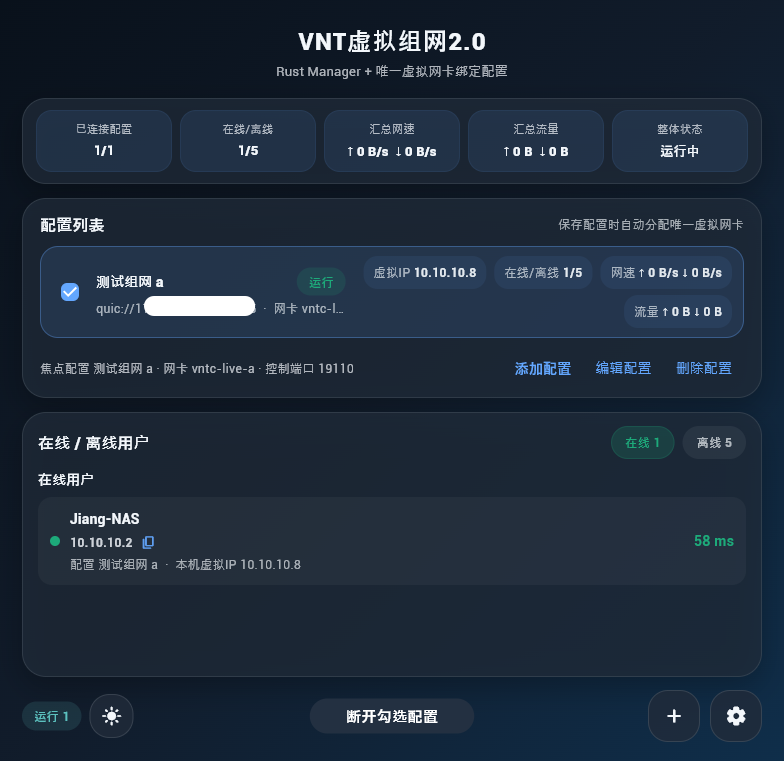
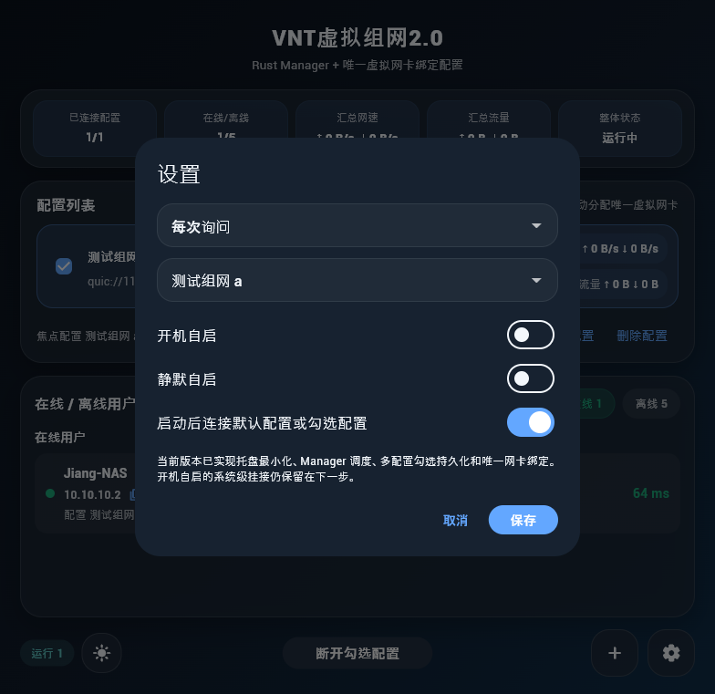
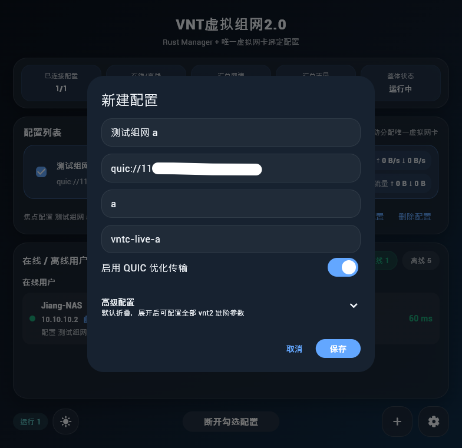
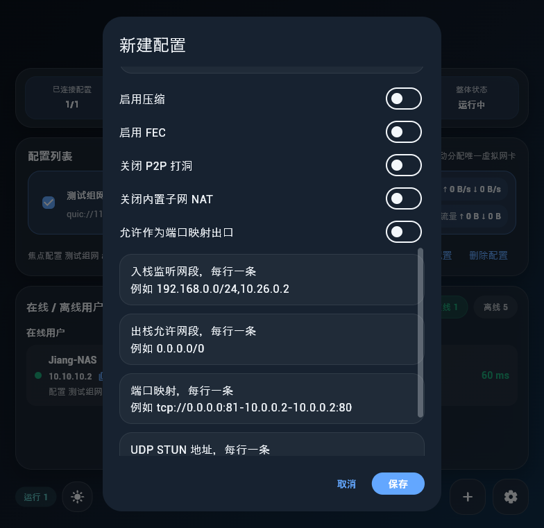

# VNTC 2.0 Client

Language:
- English: this page
- 中文: [README.md](README.md)

VNTC 2.0 Client is a Windows desktop GUI for VNT 2.0 built on top of `Flutter Windows + Rust Manager + vnt2_cli`.

It is designed for daily use and focuses on making VNT 2.0 easier to manage through a desktop interface instead of command-line-only workflows.

The client now includes a bilingual interface. Users can switch between Simplified Chinese and English directly from the settings page, and first-time startup follows the operating system language by default:

- Chinese systems open in Simplified Chinese
- Non-Chinese systems open in English

## Download

Prebuilt Windows packages are available on GitHub Releases:

- [Latest Releases](https://github.com/luojiang419/VNTC-2.0-client/releases)

Available package types:

- Installer package: `.exe`
- Portable package: `.zip`

## Highlights

- Multi-profile management in one desktop app
- Automatic allocation of a dedicated `tun_name`, `ctrl_port`, and `device_id` for every profile
- Batch connect / disconnect for selected profiles
- Aggregated online / offline peer view
- Advanced profile editor for vnt2 options
- System tray support with minimize-to-tray behavior
- Windows auto-start and silent startup
- Simplified Chinese / English UI switching

## Why This Client

Compared with running multiple CLI instances manually, this client provides:

- A single desktop application for managing multiple VNT sessions
- Batch connect / disconnect for selected profiles
- Aggregated online / offline peer visibility
- A more convenient editor for advanced VNT profile settings
- Better day-to-day Windows usability through tray integration and startup options

## Language Switching

To change the interface language:

1. Open `Settings`
2. Find the `Language` dropdown
3. Choose `简体中文` or `English`

The selected language is saved locally and will be reused the next time the app starts.

## Screenshots



| Profiles and Status | Online / Offline Peers |
| --- | --- |
|  |  |

| Advanced Settings |
| --- |
|  |

## Project Structure

- `vntc2_flutter/`: Flutter Windows frontend
- `vnt-2.0.0/vntc-manager/`: Rust Manager for multi-profile orchestration and aggregated APIs
- `vnt-2.0.0/`: VNT 2.0 sources plus `vnt2_cli` / `vnt2_ctrl`
- `软件截图/`: screenshot assets

## Main Features

- Profile list with per-profile runtime status
- Online / offline peer tabs
- One-click virtual IP copy
- Advanced profile editing
- Unique adapter and control port allocation
- Tray menu with quick actions
- Windows auto-start and silent startup

## Build

### Flutter Windows

```bash
cd vntc2_flutter
flutter pub get
flutter build windows
```

### Rust Binaries

```bash
cd vnt-2.0.0
cargo build --release --features vnt-ipc -p vnt2 -p vntc_manager
```

## Runtime Files

The release package expects the following files in the same directory:

- `vntc2_flutter.exe`
- `vntc_manager.exe`
- `vnt2_cli.exe`
- `vnt2_ctrl.exe`
- `wintun.dll`
- `data/`

## Thanks

- VNT 2.0
- Flutter
- Rust
